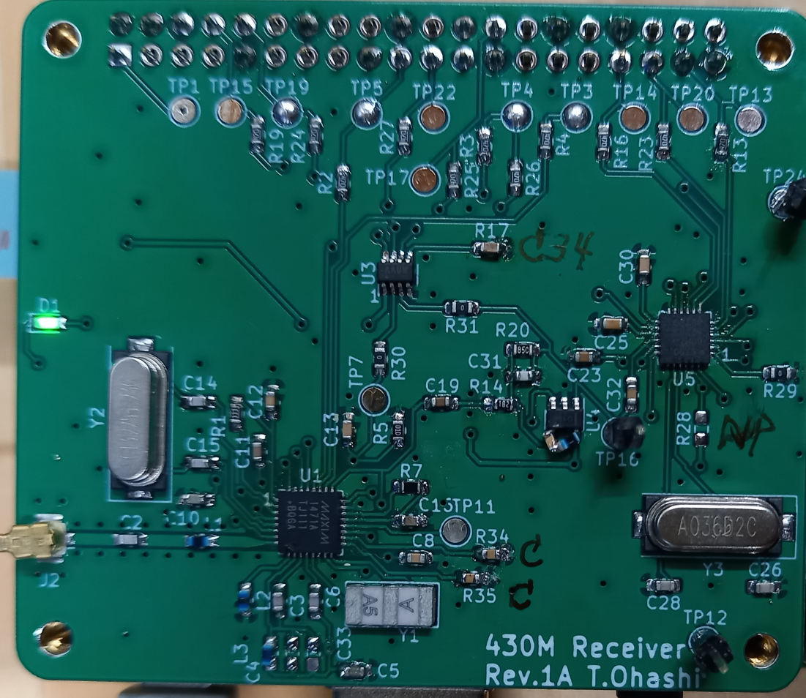

# MAX1471＋AD5700 430MHz AFSK receiver for Raspi

Receive 1200bps AFSK modulated waves in the 430Mhz band with RaspberryPi and an expansion board (MAX1471 + AD5700 430M radio hat, home made, see hat directory).
(In the photo, the LC series trap is directly attached to the U4 pin, but it has been modified in the circuit diagram.)

・The receiving frequency is fixed at the frequency determined by the XTAL frequency.

-Confirmed reception of a 1200bps AFSK signal in Asynchronous format (UART) sent by Gnuradio+Pluto. 

Please refer to the gnuradio directory for the transmitting program.

# Environment where operation has been confirmed
Raspi3B+　Raspberry Pi OS(bookworm)

You need to install pigpio.

# HAT configuration and operation
I use Analog Devices' MAX1471 for reception and AD5700 for AFSK demodulation.

MAX1471 operates in Continuous Receive Mode.

## receiving data
The received data RXD is connected to GPIO15 (pin10) of Raspi, and if the received data is in UART format, it can be treated as /dev/ttyAMA0 by setting UART on Raspi, and it can be displayed on minicom.
(Device name may vary depending on Raspino model)

`Example) $ cat /dev/ttyAMA0`

`Example) $ minicom -b 1200 -D /dev/ttyAMA0`

Since there is no squelch, the data becomes meaningless when there is no signal.

You can determine whether there is a received signal by looking at the CD signal of the AD5700 or by the size of the RSSI signal.

Please refer to rxafsk.py.

## receiving frequency
The receiving frequency is determined by the Xtal frequency using the following formula.
$$ frx = (fxtal * 32) + 10.7 (MHz) $$

13.2256MHz becomes 433.920MHz.

Although the data sheet says, the sensitivity is higher at frequencies slightly lower than this.
The prototype board had better sensitivity at frequencies several tens of KHz lower.

If you want to change the receiving frequency, you must also change the value of register 3 to fxtal/100kHz. (FREQ_XTAL in rxafskconst.py Please check the data sheet for details.)

# Software

The SPI of MAX1471 is controlled from the Raspi, but it is controlled by itself via GPIO, so there is no need to configure the SPI of the Raspi.
If SPI0 is enabled, please disable it. (Access as GPIO)

## rxafsk.py

If you run it from the command line as $ python rxafsk.py, it will perform the receiving operation.

Place regs.py, rxafskconst.py, and spi.py in the same directory.

When you run it, a prompt like "H>" will appear, allowing you to enter commands.

The prompt color is green when the synthesizer is locked, and red when it is not locked. (LOCKDET bit in Status Register)

When the LNA is High-gain, it is "H>", and when it is Low-gain, it is "L>".

### Command
The following commands can be entered when the prompt is displayed.
### reset
Reset and initialize the MAX1471 and AD5700.

### rssi/r
Measures the received RSSI voltage and displays it in V units.

### cal/fskcal
Calibrate the FSK demodulator of MAX1471.

For some reason, sometimes (especially when receiving a weak signal?) when I perform calibration, the reception sensitivity and FSK signal output size change, and the signal that I was able to receive before can no longer be received (sensitivity worsens). The cause is unknown...
If you calibrate again, it will usually return to normal.

The data sheet says it is necessary if the voltage or temperature changes, but it may be better not to do this when reception is normal.

### read/rd n
Reads the contents of register number n (0-3,9) of MAX1471 and displays it in binary.

example:

H>read 0

Reg 0 = 11110110

### read/rd cd
Read the CD signal of AD5700.

### write/wr n data
Write data to register n of MAX1471. Enter data in hexadecimal.

example:

H>wr 0 f6

H>rd 0

Reg 0 = 11110110

===

Have A Fun!
