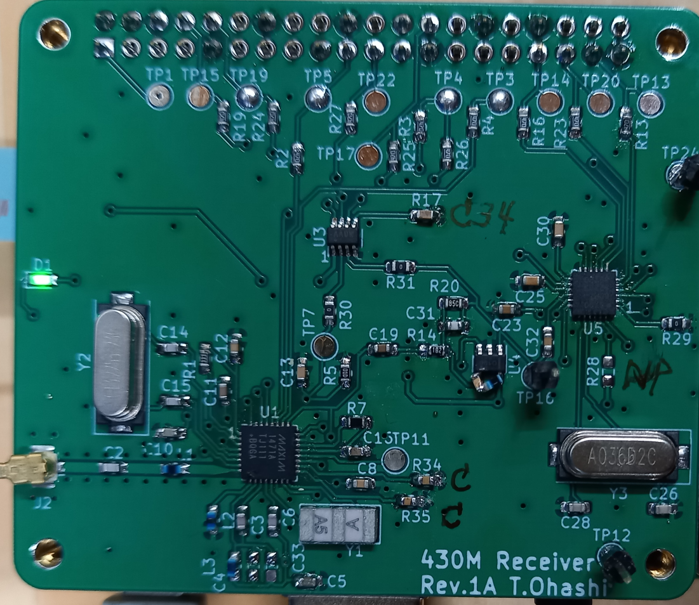

# MAX1471＋AD5700 430MHz AFSK receiver for Raspi

RaspberryPiと拡張基板（MAX1471 + AD5700 430M radio hat、自作、hatディレクトリ参照）で430Mhz帯で1200bpsのAFSK変調波を受信します．
(写真ではU4のピンにLC直列トラップが直付けされていますが回路図では修正してあります．)

・受信周波数はXTALの周波数で決まる周波数で固定です．

・Gnuradio+Plutoで送信した調歩同期（UART）形式の1200bpsAFSK信号の受信を確認しました．

送信プログラムはgnuradioディレクトリを参照してください．

# 動作確認した環境
Raspi3B+　Raspberry Pi OS(bookworm)

pigpioのインストールが必要です．

# HATの構成と動作
受信にはAnalog Devices社のMAX1471を、AFSKの復調にはAD5700を用いています．

MAX1471はContinuous Receive Modeで動きます．

## 受信データ
受信データRXDはRaspiのGPIO15(pin10)に接続されており、受信データが調歩同期（UART）形式の場合、Raspi側でUARTの設定すれば/dev/ttyAMA0として扱うことができ、minicomで表示したりできます．（Raspinoモデルによりデバイス名は異なるかも知れません）

`例） $ cat /dev/ttyAMA0`

`例） $ minicom -b 1200 -D /dev/ttyAMA0`

もちろん、調歩同期以外の形式でも受信します．

スケルチはありませんので無信号時には意味のないデータになります．

AD5700のCD信号を見るか、RSSI信号の大きさで受信信号の有無を判断できます．

## 受信周波数

受信周波数は以下の式によりXtalの周波数により決まります．
$$ frx = (fxtal * 32) + 10.7 (MHz) $$

13.2256MHzでは433.920MHz になります．

とデータシートにはありますが、これより少し低い周波数のほうが感度が高いです．
試作基板では数十KHｚ低い周波数でより感度が良かったです．

受信周波数を変更する場合はあわせてレジスタ３の値をfxtal/100kHzに変更する必要があります．（rxafskconst.pyのFREQ_XTAL、　詳しくはデータシートを確認ください．）

# ソフトウェア

MAX1471のSPIはRaspiから制御しますがGPIO経由で自前で制御していますのでRaspiのSPIの設定は不要です．
もし、SPI0が有効になっている場合は無効にしてください．（GPIOとしてアクセスします）

## rxafsk.py

コマンドラインから $ python rxafsk.py として実行すると受信動作を行います．

同じディレクトリに　regs.py 、　rxafskconst.py 、spi.py　を置いてください．

実行すると "H>" のようなプロンプトが表示され、コマンドを入力できます．

プロンプトの色はシンセサイザーがロックしていると緑色に、ロックしていない時は赤色なります．（Status RegisterのLOCKDETビット）

LNAがHigh-gain のときは"H>"、Low-gain のときは"L>"になります．

### コマンド
プロンプト表示時に入力できるコマンドには以下のものがあります．
### reset
MAX1471とAD5700をリセットして初期化します．

### rssi/r
受信しているRSSI電圧を測定、V単位で表示します．

### cal/fskcal
MAX1471のFSK復調部のキャリブレーションを行います．

なぜかときどき（特に弱信号受信時?）キャリブレーションを行うと受信感度とFSK信号の出力の大きさが変化していままで受信できていた信号が受信できなくなる(感度が悪くなる)ことがありますが原因は不明です...
もう一度キャリブレーションを行うと大抵正常になります．
データシートでは電圧や温度が変化したら必要とありますが正常に受信できている時は行わない方がよいかも知れません．

### read/rd n
MAX1471のレジスタ―番号n（0-3,9）の内容を読み出して２進数で表示します．

例：

H>read 0

Reg 0 = 11110110

### read/rd cd
AD5700のCD信号を読み出します．

### write/wr n data
MAX1471のレジスタnにdataを書き込みます．dataは１６進数で入力します．

例：

H>wr 0 f6

H>rd  0

Reg 0 = 11110110

＝＝＝

Have A Fun!
